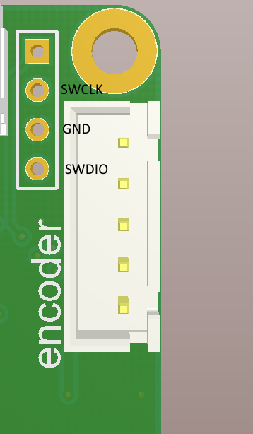

## 4tune controls 
This instruments for support fortune controller.

 - /Lib contain all python libs you need to control our controller
 - /Utilities/Flasher utile to flash new firmware via modbus
 - /firmware/bootloader flash it via STlink ony first time
 - /firmware/app flash it via Flaser

## Flasher
It's simple example of bootloader commands implementation in python class 
Usage examples 
`python flasher.py R COM5  2.hex` - read flash via COM5 and saves it to `2.hex`
`python flasher.py W COM5 main.hex` - write main.hex via COM5 to flash

**Flash bootloadr(only once)**
 1. Clone git
 2. Find stlink or stm32 discovery board
 3. Connect stlink 1 pin(not solder) NC, 2 - clock, 3- GND, 4-data
 4. Install [Stlink utile](https://www.st.com/en/development-tools/stsw-link004.html)
 5. Erase all flash memory
 6. Open fortune-controls\firmware\bootloader\main.hex
 7. Flash it
 
Now board have it's one bootloader and starts blink green led.

**Flash main application**

Run `python flasher.py R COM5  ..\..\firmware\app\main.hex` 
Replace COM5 to you serial interface, in linux use all path like \dev\ttyUSB1

If it's all ok, at poweron green led starts blink for 2 seconts, then weakly glow - It't redy to work.

**Known problems**

Change boundrate and modbus id only from `l = ModBusBootLoader()` class
`l.write_id_speed(2,10)` - set id to 2 and boundrate to 115200

**Load sensor config**

Use some code 

`client= ModbusClient(method = "rtu", port="COM5", stopbits = 1,
                     bytesize = 8, parity = 'N', baudrate= 115200,
                     timeout = 0.8 )`
					 					 
`client.connect()`

`M = X4Motor(client, 1)`

`M.loadsensorconfig("1.npy")`

`M.save2flash()`

in Linux use full path like `\dev\ttyUSB0` instead COM5

don't forget import libs

`from pymodbus.client.sync import ModbusSerialClient as ModbusClient #initialize a serial RTU client instance`

`from x4motor import X4Motor`
